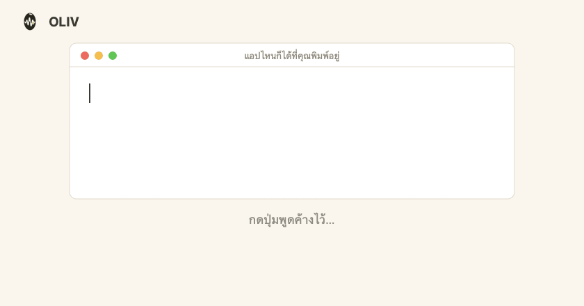

<picture>
  <source media="(prefers-color-scheme: dark)" srcset="docs/img/oliv-mark-white-160.png">
  
</picture>

# OLIV — Offline Local Inference Voice

**Fully-local Thai + English push-to-talk dictation for macOS.**
Speak Thai mixed with English tech terms; OLIV types it back *right* — on your Mac, no cloud.

> 🇹🇭 **ย่อ:** พิมพ์ด้วยเสียง ไทยปนอังกฤษ บน Mac ทำงานในเครื่องทั้งหมด ไม่ส่งเสียงขึ้น cloud
> STT ไทยมักเขียนคำอังกฤษเป็นตัวไทยเพราะเสียงคล้าย (`ดีพลอย`, `เกรดเวย์`) — OLIV คืนมันกลับเป็น `deploy`, `gateway`
> **[อ่าน README ภาษาไทยฉบับเต็ม →](README.th.md)**

<a href="https://github.com/chayapats/oliv/releases/latest/download/OLIV.dmg"></a>

**One click — the `.dmg` downloads immediately.** Apple Silicon (M1+) · free & open source · [all versions](https://github.com/chayapats/oliv/releases)



📊 **[Honest benchmark & how accurate it is →](https://chayapats.github.io/oliv/)** · 
the full write-up lives in [`docs/index.html`](docs/index.html) (bilingual, reproducible, failures shown).

---

## What it does

Thai speech-to-text writes English words in Thai script because they sound alike. OLIV's pipeline restores just those words and nothing else:

```
heard   ตัวบิวท์เฟลล์เพราะดิเพนเดนซี่เวอร์ชั่นไม่ตรง
OLIV →  ตัว build fail เพราะ dependency version ไม่ตรง
```

Pipeline: **Typhoon-turbo STT** (Thai fine-tune of Whisper-turbo) → deterministic dictionary/phonetic fixes → a small **Gemma-E2B** cleanup model that de-transliterates. Everything runs on-device.

## How accurate — honestly

Meaning-match (LaBSE semantic similarity, a clip counts at ≥ 0.80 — **this is not word-for-word accuracy**), fresh run of the shipped pipeline:

| Set | Meaning match | n |
|---|---|---|
| **Held-out** (fresh jargon, never tuned on) | **~90%** | 40 |
| Tuning | ~92% | 194 |
| Confirmation | ~87% | 30 |

- The cleanup model earns its keep: on the held-out set, **without it the number falls to ~65%**.
- Against the cloud: OLIV's full local pipeline beats raw Groq-hosted Whisper large-v3 (~84%) — while staying private and about half the size. But note: OLIV's *raw* STT is actually a bit *weaker* than the big cloud model; the win is the full pipeline, not raw transcription.

**Read the [limitations](docs/index.html) before trusting these numbers** — especially: the benchmark was recorded by **one speaker** (the developer), so cross-speaker/accent/noise performance is untested. Names and numbers can be wrong even when meaning counts as a match — glance before sending.

## Requirements

- **Apple Silicon** Mac (M1 or newer), macOS
- One-time model download **≈ 5 GB**, pulled from Hugging Face on first run:
  - STT ~1.5 GB — [`chayapats/typhoon-whisper-turbo-mlx`](https://huggingface.co/chayapats/typhoon-whisper-turbo-mlx) (our MLX conversion of SCB 10X's Typhoon)
  - Cleanup ~3.3 GB — [`mlx-community/gemma-4-e2b-it-4bit`](https://huggingface.co/mlx-community/gemma-4-e2b-it-4bit)
- Fully offline after that · ~1.1–1.3 s per phrase

## Install

1. [**Download OLIV.dmg**](https://github.com/chayapats/oliv/releases/latest/download/OLIV.dmg) (or pick a version from [Releases](https://github.com/chayapats/oliv/releases))
2. Open it, drag **OLIV** into **Applications**, launch
3. Grant microphone + accessibility permissions, set a push-to-talk hotkey in Settings

## Features & what you can customize

More than the defaults suggest — everything lives in the menu-bar olive icon and **Settings…** (⌘,).

**The menu**
- **Recent…** — your last 10 dictations; click one to copy it back (⌘V to paste). In memory only: quitting clears it, and a Settings toggle turns it off (clearing immediately).
- **Last-dictation line** — `Last: 1.4s · 38 chars` after each utterance, so you know it worked and how fast.
- **Copy Diagnostics** — one-click plain-text support report (app/OS versions, engine, toggles, permissions, model status). Never includes transcripts or your API key.

**General**
- **Push-to-talk key** — default is Right ⌥ Option; record any key you like, applied live.
- **STT engine** — Thai-first Typhoon turbo (default), Pathumma (legacy), or English-heavy Whisper large-v3. Missing engine weights download in place with a progress bar.
- **Recording indicator** — the floating waveform pill; can be hidden.
- **Launch at login**, recent-transcripts toggle.
- **Cloud fallback (opt-in, OFF by default)** — a Groq large-v3 cloud engine appears only after you enable it *and* add an API key. Audio leaves your Mac only while that engine is selected; every other engine is fully local.

**Cleanup**
- Global cleanup on/off; **filler-word removal** (อืม/เอ่อ/um…, on by default); **spoken formatting commands** ("new line / ขึ้นบรรทัดใหม่", "new paragraph / ย่อหน้าใหม่", "bullet point" — off by default, since a command phrase can be real content).
- **Per-app verbatim list** — apps where text pastes exactly as heard, no cleanup (terminals, password managers…).

**Replacements** — spoken phrase → exact text, e.g. "อีเมลของผม" → `me@example.com`. Rewrites *after* transcription.

**Vocabulary** — your names/jargon/acronyms bias *recognition itself*, so a word STT kept mishearing comes out right from the start — the fix for a term Replacements can't catch reliably.

**Models** — what's downloaded, sizes, storage path, re-download / re-check.

## Reproduce the benchmark

The eval harness drives the **real shipping code path** (not a re-implementation):

```bash
# fresh benchmark of the shipped config over all sets:
# (model repos default to the shipped ones; point OLIV_TYPHOON_MLX_REPO at a
#  local path or another HF repo only if you want to swap the STT weights)
HF_HUB_DISABLE_XET=1 \
  sidecar/.venv/bin/python benchmark/eval_cleanup.py \
    --manifest data/manifest_all.jsonl --engine typhoon-turbo-mlx --out benchmark/eval_results/ship_main.json
sidecar/.venv/bin/python benchmark/semantic_score.py     # LaBSE meaning over eval_results/*.json
sidecar/.venv/bin/python benchmark/build_report_data.py  # + surface metrics -> report_data.json
sidecar/.venv/bin/python benchmark/build_landing.py      # regenerate docs/index.html
```

Manifests: `benchmark/data/manifest_{all,holdout,d2}.jsonl` (264 clips; audio not tracked). Metric: `benchmark/semantic_score.py` (LaBSE, Thai word-segmented before embedding, threshold 0.80).

## License

- **Models:** Typhoon-whisper-turbo weights are MIT, inherited from SCB 10X's [`typhoon-ai/typhoon-whisper-turbo`](https://huggingface.co/typhoon-ai/typhoon-whisper-turbo) and OpenAI Whisper — OLIV ships [an MLX conversion](https://huggingface.co/chayapats/typhoon-whisper-turbo-mlx) of those weights, all credit for the model to the original authors. The cleanup model follows its own upstream license.
- **App / code:** [MIT](LICENSE) — © 2026 Chayapat Sriwattanachote.

Third-party names (Groq, Whisper, etc.) belong to their owners; benchmark comparisons are on our own Thai–English dictation set, tested once.
