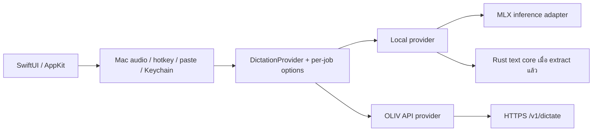

> Historical document: paths and commands describe the implementation at the time. Current native tooling is documented in [native-developer-tools.md](native-developer-tools.md).

# OLIV macOS: OLIV API compatibility และความคุ้มค่าของ Rust

ตรวจเมื่อ 7 ตุลาคม 2026 · เป็นการประเมินก่อน implement

## ข้อเสนอ

เพิ่ม OLIV API เป็นตัวเลือก engine แบบ opt-in โดยให้ endpoint ทำ STT และ cleanup ครบหนึ่งครั้ง เก็บ SwiftUI/AppKit, CoreAudio/AVFoundation, hotkeys, Keychain และ text injection ของ macOS ไว้ จากนั้นค่อยแยก transport และ text pipeline ที่ใช้ร่วมหลายแพลตฟอร์มเป็น Rust core

การเพิ่ม API มีความคุ้มค่าสูงและไม่จำเป็นต้องรอ rewrite การใช้ Rust มีประโยชน์ชัดกับ logic ที่ตอนนี้ซ้ำกันใน macOS/Linux/Windows แต่การย้าย UI และระบบเสียงของ Mac เป็น Rust ทั้งหมดให้ประโยชน์น้อยกว่าและเพิ่มพื้นที่ regression มาก ส่วนการเอา Python ออกจากโหมด offline ต้องแก้ inference runtime ด้วย การพอร์ต text processing อย่างเดียวไม่ทำให้ Python/MLX หายไป

สมมติฐานในการประเมิน: OLIV macOS ยังคงมีโหมด local เดิม และเพิ่ม remote engine เป็นอีกทางเลือก หากเป้าหมายเปลี่ยนเป็น client ใช้ API อย่างเดียว งาน packaging จะเล็กลงมาก เพราะไม่ต้อง bundle inference runtime หรือดาวน์โหลดโมเดลในเครื่อง

## หลักฐานและขอบเขต

| สิ่งที่ตรวจ | เวอร์ชัน / ผล |
|---|---|
| OLIV ใน workspace | `39c10cf744befa88e33b8353b594f4ff0d721d54`, working tree สะอาดก่อนเริ่ม |
| oliv-linux main | `0000a4de36413075788945ae7d12fce8caa06466`, clone ชั่วคราวเพื่ออ่าน |
| Python reference ของ Rust port | ระบุ OLIV `39c10cf744befa88e33b8353b594f4ff0d721d54` ตรงกับ workspace นี้ |
| Public API contract | oliv-windows `3d7127a3c9893c1a17ad9cd4aebdda4c197144dc`, ซึ่ง Linux migration ใช้อ้างอิงเช่นกัน |
| Live endpoint | HTTPS `GET https://oliv.redcomp.tech/health` ได้ `{"ok":true}` โดยไม่ใช้ Authorization และไม่ตาม redirect |
| Groq availability checks | `sidecar/test_groq_backend.py`: 5 ผ่าน |
| Sidecar text passes | `sidecar/test_text_passes.py`: 86 ผ่าน |
| Pipeline spacing | `benchmark/test_pipeline_spacing.py`: 17 ผ่าน |
| Rust fixtures | นับไฟล์จริงได้ 33 ไฟล์ รวม 76,650 cases; เป็นจำนวน fixtures ไม่ใช่ tests ที่รันในรอบนี้ |

การตรวจครั้งนี้ไม่ใช้ key จริง ไม่ส่งเสียงหรือ transcript ไป endpoint ไม่เปลี่ยน VM/config/credentials และไม่ทดสอบ live authenticated dictation ไม่มี `cargo`/`rustc` ในเครื่องที่ตรวจ จึงยังไม่ยืนยันว่า Rust crate build/test ผ่านบน Apple Silicon ตัวเลขผลทดสอบ Linux ที่อยู่ใน upstream เป็นหลักฐานของ upstream ไม่ใช่ผลรอบนี้ ไม่ได้รัน Xcode tests หรือ benchmark โมเดลใหม่ เพราะยังไม่มีการเปลี่ยน application code

แหล่งอ้างอิงหลัก:

- [Linux migration และ transport policy](https://github.com/chayapats/oliv-linux/blob/0000a4de36413075788945ae7d12fce8caa06466/docs/API-MIGRATION.md)
- [Linux API client](https://github.com/chayapats/oliv-linux/blob/0000a4de36413075788945ae7d12fce8caa06466/client/src/api.rs)
- [Public API contract](https://github.com/chayapats/oliv-windows/blob/3d7127a3c9893c1a17ad9cd4aebdda4c197144dc/docs/PUBLIC-API.md)
- [Rust reference commit](https://github.com/chayapats/oliv-linux/blob/0000a4de36413075788945ae7d12fce8caa06466/server/reference/OLIV_COMMIT)
- [Known differences จาก Python](https://github.com/chayapats/oliv-linux/blob/0000a4de36413075788945ae7d12fce8caa06466/server/oliv-api/KNOWN_DIFFS.md)

ข้อสำคัญ: server scripts ใน oliv-linux เป็น snapshot ก่อน public API migration ฝั่ง client อัปเดตแล้ว แต่ไม่ควรใช้ server auth/health implementation ใน repo นั้นเป็นข้อยืนยันระบบ public ปัจจุบัน คู่มือ migration ชี้ไป contract ฝั่ง oliv-windows

## API compatibility

| ส่วน | macOS ปัจจุบัน | OLIV API / Linux client | งานที่ต้องทำ |
|---|---|---|---|
| Transport | Python child process, JSON lines, request `id` | HTTPS JSON `POST /v1/dictate` | แยก provider ระดับ dictation ออกจาก sidecar |
| Audio | mono 16 kHz Float32, `pcm_b64` ไม่มี WAV header | RIFF/WAVE PCM signed 16-bit little-endian, `wav_b64` | clamp/quantize Float32 เป็น Int16 และ encode WAV ทั้งไฟล์ก่อน base64 |
| รูปแบบ request | `cmd`, `engine`, optional flags | `wav_b64`, `cleanup`, `remove_fillers`, `thai_format`, `vocabulary`, `replacements` | สร้าง schema ใหม่ ไม่ส่ง body ของ sidecar ตรงๆ |
| Authentication | Groq key ผ่าน env ไป Python | Bearer key รายคน/อุปกรณ์, scope `dictate` | Keychain account แยกสำหรับ OLIV API; URL/timeout เก็บเป็น non-secret settings |
| Pipeline | local STT แล้ว local cleanup | server ทำ STT + cleanup + replacements + Thai format | รับ `final` ไป paste โดยไม่รัน cleanup ซ้ำใน Mac |
| Bool defaults | filler/Thai-format ปิดส่งด้วยการละ field; sidecar default false | endpoint defaults true | ส่งค่า boolean ชัดเจนทั้ง true และ false ทุก request |
| Per-app cleanup | resolve จาก bundle ID ก่อนส่ง | รับ `cleanup` แต่ไม่รู้ frontmost app | คงการ resolve ฝั่ง Mac; `thai_format = setting && effectiveCleanup` |
| Spoken formatting | `format_commands` + split/clean/join ก่อน Thai format | Linux v1 ไม่พอร์ตและไม่ส่ง field นี้ | ต้องแสดงว่า remote mode ยังไม่รองรับ หรือเพิ่ม capability พร้อม server change |
| Vocabulary | บาง local models seed Whisper prompt; Typhoon ไม่ seed | Typhoon ใช้ post-STT vocabulary correction | ส่ง vocabulary ได้ แต่ไม่รับรอง decode-time bias เท่ากับทุก local engine |
| Replacements | Swift dictionary → JSON object; matcher longest-first | รักษาลำดับ JSON; longest-first, equal-length ties ตาม table order | กำหนดลำดับ serialization ให้แน่นอน และทดสอบคำซ้อน/ความยาวเท่ากัน |
| Result | `raw`, `final`, timings, cleanup metadata | คล้ายกัน + `no_speech`, `stt_redecoded` | DTO ร่วม, metadata optional; ต้อง validate `ok`/`final` และ no-speech |
| Duration | capture ceiling 600 วินาที | สูงสุด 120 วินาที | cap ตาม provider ตั้งแต่เริ่มอัด แจ้งเมื่อเต็ม ไม่ตัดทิ้งเงียบๆ |
| Timeout | sidecar dictate 30 วินาที | global timeout default 120, ตั้งได้ 10–180 วินาที | ใช้ budget ของ remote provider ไม่ reuse 30 วินาที |
| Health | ping sidecar / local model state | `/health` แสดง liveness เท่านั้น | ปุ่มตรวจ connection ได้ แต่ไม่ถือว่า key/models พร้อมและไม่ใช้เป็น inference preflight |
| Readiness | onboarding/badge ต้องมี local STT + cleanup models | remote client ไม่ต้องมี local models | คำนวณ prerequisites ตาม provider และไม่ warm/download MLX เมื่อใช้ remote |
| Failure recovery | Groq ล้มเหลวลอง local หนึ่งครั้ง; ถ้าล้มเหลวหมดเสียงถูก drop | Linux เก็บ pending WAV + manual retry + cooldown | แยก remote error policy; recovery ต้องไม่ส่ง inference ซ้ำอัตโนมัติ |
| History | recent 10 รายการใน memory; toggle ปิดแล้วล้าง | Linux มี history/pending บน disk | ไม่คัดลอก persistence policy มาโดยไม่ออกแบบ retention/settings |

WAV 120 วินาทีมี PCM 3,840,000 bytes บวก header 44 bytes; base64 ประมาณ 5.12 MB ก่อน JSON อยู่ใต้ request ceiling 8 MiB แต่ยังต้องตรวจ body รวม vocabulary/replacements ด้วย client ใช้ response ceiling 1 MiB ตาม Linux

### Request ที่ควรส่ง

```http
POST /v1/dictate
Authorization: Bearer <individual-api-key>
Content-Type: application/json
User-Agent: oliv-macos/<app-version>
```

```json
{
  "wav_b64": "<standard-base64-of-complete-PCM16-WAV>",
  "cleanup": false,
  "remove_fillers": false,
  "thai_format": false,
  "vocabulary": [],
  "replacements": {}
}
```

ตัวอย่างใช้ false เพื่อเน้นว่าต้องส่งค่า off ชัดเจน ค่าจริงมาจาก settings ที่ snapshot ต่อ dictation ไม่ส่ง `prompt` เพื่อใช้ server default แบบ Linux ไม่ต้องขอ scope `clean` เพิ่มเพื่อ cleanup ภายใน `/v1/dictate` และไม่เรียก `/v1/status` ผ่าน public hostname

คำว่า verbatim ในโค้ดเดิมหมายถึง bypass LLM cleanup แต่ filler removal/replacements/format commands มี flag แยกและยังอาจทำงาน ต้องรักษาพฤติกรรมจริงที่ tests ครอบอยู่ การเปลี่ยนให้ verbatim ปิดทุก transform ควรเป็นการตัดสินใจ product แยกจากงาน endpoint นี้

### Transport และ recovery ที่ต้องรักษา

- ตรวจ TLS chain/hostname ตามปกติ; ปฏิเสธ redirect ทุกชนิด ระบุ User-Agent ของ OLIV จริง และรับเฉพาะ URL รูปแบบที่ policy อนุญาต
- หากใช้ Swift URLSession ให้กำหนด redirect delegate และ total request deadline ชัดเจน ไม่อาศัยค่า default อย่างเดียว หากใช้ Rust ให้ยก transport policy และ TLS tests มาจาก Linux client
- public URL ใช้ HTTPS; ถ้าจะ parity กับ Linux ให้ HTTP เป็นตัวเลือกเฉพาะ explicit development URL เช่น localhost/literal loopback/private IPv4/CGNAT ตาม policy เดิม
- HTTP 200 ต้องมี `ok:true` และ `final` เป็น string ยกเว้น response no-speech ที่ contract ยอมรับ; `{"ok":true}` อย่างเดียวไม่ใช่ dictation success
- `no_speech:true` หรือ final ว่างไม่ paste; `cleanup_error` พร้อม final ที่ใช้ได้ยังถือว่ามีข้อความสำเร็จ
- HTTP 401/403 แสดงปัญหา key/scope/edge; 400/415 ปัญหา request; 413 เกินขนาด; 429/503 cooldown; 502/504/network/timeout แสดง failure พร้อม recovery path
- เคารพ `Retry-After` ทั้ง delta-seconds และ HTTP-date ตาม Linux; 429 ที่ไม่มี header ใช้พัก 60 วินาที; 5xx ที่มี header พักตาม header
- serialize remote requests หนึ่งงานต่อ client/key, ไม่มี automatic remote inference retry; cancel ฝั่ง client ไม่รับรองว่า server หยุด inference แล้ว API ยังไม่มี idempotency contract
- การ fallback เป็น local ทำได้เมื่อผู้ใช้เลือก policy นั้นและโมเดลพร้อม ไม่ควรทำให้ API-only setup ต้องดาวน์โหลดหลาย GB เมื่อเกิด network error
- failed-audio recovery หากเพิ่ม ให้เป็นตัวเลือกชัดเจน พร้อม private storage, expiry/delete, cooldown และ manual retry; retry ที่กู้สำเร็จให้ copy/review เพื่อไม่ paste ลงแอปที่เปลี่ยนไปแล้ว

## Rust: reuse ได้แค่ไหน

### Text pipeline มีฐานที่ตรงกับ OLIV แล้ว

Rust crate `server/oliv-api` มี library ชื่อ `oliv_pipeline` ครอบ dictionary, phonetic/vocabulary, newmm/TCC tokenizer, gate, guardrails, fillers, hallucination text gates, Thai spacing/casing/number formatting รวมถึง trait สำหรับ STT/LLM

Python reference pin ตรงกับ commit ใน workspace นี้ ชุด fixtures มี `clean_ex` 1,942 cases, dictate text path 2,246 cases และ tokenizer fuzz 31,998 cases ในจำนวนรวม 76,650 กรณี Upstream ระบุว่า golden ผ่านทั้งหมด เป็นฐาน regression ที่มีค่ามากสำหรับ extraction แต่ golden replay ใช้ LLM output ที่บันทึกไว้ จึงไม่ได้พิสูจน์ว่า inference คนละ runtime จะได้ข้อความเท่ากันทุกครั้ง

ต้องเติม spoken formatting commands กับ audio silence/duration gates เพื่อให้ครอบพฤติกรรมของ local sidecar เดิมครบ บางกรณีตั้งใจต่าง เช่น LLM error เก็บ deterministic dictionary/vocab corrections ไว้, empty STT เป็น no-speech และ forced-English decode รอบสองล้มเหลวแล้วยังใช้ข้อความรอบแรกได้ ดู KNOWN_DIFFS

โค้ด library ปัจจุบันยังรวม HTTP server/config/loopback inference adapters และ compile-time paths ไป `server/data` ควรแยก crate pure text พร้อม data/licenses ออกจาก transport/server ก่อน reuse ไม่ควรยก executable `oliv-api` ทั้งตัวมาเป็น core ของ Mac

### Client Linux ยกมาทั้งตัวไม่ได้

client ผูกกับ PipeWire, Wayland/Smithay, Hyprland, `wl-copy`/`wl-paste` และ `eventfd` ของ Linux ส่วนที่นำมาใช้ต่อได้คือ API schema, WAV encoding, URL/timeout/TLS/redirect policy, error mapping, cooldown และแนวคิด single worker/recovery ต้องตัดความสัมพันธ์กับ config/store ของ Linux ออกก่อนทำ crate portable

ฝั่ง macOS มี Swift application sources 23 ไฟล์ประมาณ 8,905 บรรทัด รวมระบบ Bluetooth microphone readiness, echo cancellation, output ducking, capture teardown, key chords, secure-input/clipboard handling และ TCC/signing behavior การ rewrite พื้นที่นี้เพิ่มงาน native interop แต่ไม่ได้ลดงาน inference ของโมเดลโดยตัวมันเอง

### Rust core ไม่ได้แปลว่า inference ทั้งหมดเป็น Rust

Linux ใช้ Rust orchestration/text pipeline แต่ STT ยังเรียก Python `faster-whisper` และ cleanup เรียก C/C++ llama runtime ส่วน Mac ใช้ Python `mlx-whisper` และ `mlx-lm` การเปลี่ยน wrapper เป็น Rust ไม่ได้ทำให้ kernel ที่หนักเปลี่ยนตาม และไม่ควรคาดว่าจะเร็วขึ้นเพียงเพราะเปลี่ยนภาษา

โมเดลใน Mac เป็น MLX weights ส่วน server ใช้ runtime/quantization/decoding/prompt ที่ต่างกัน `server/vm/config.toml` ใน Linux snapshot ตั้ง prompt v5 แต่ Mac default v2; public health ไม่เปิดเผย prompt จริง จึงยังไม่ทราบ runtime config ของ deployment ห้ามอ้างว่าจะ output เหมือน local ทุกประโยคเพราะ golden ผ่าน

ทางเลือกสำหรับตัด Python ในโหมด offline:

| ทางเลือก | ความเป็นไปได้จากหลักฐาน | สิ่งที่ยังต้องพิสูจน์ |
|---|---|---|
| Rust text core + Python MLX inference adapter | ย้าย deterministic logic ได้โดยยังใช้ weights/runtime เดิม | IPC/FFI, warm/model lifecycle, formatter/audio-gate parity; Python bundle ยังจำเป็น |
| Rust text core + Swift MLX cleanup | upstream MLX Swift LM มี Gemma 4 E2B/E4B support | checkpoint ที่ OLIV ใช้, tokenizer/chat template/thinking-off/stops, concurrency และ latency/quality จริง |
| Rust orchestration + whisper.cpp/llama.cpp | whisper.cpp มีเส้นทาง convert HF fine-tuned models; llama.cpp รองรับ Apple Silicon/Metal | Typhoon conversion/decode quality, GGML/GGUF weights, model downloads/cache migration, signed packaging |
| MLX inference ผ่าน Rust bindings | มี mlx-rs ซึ่งระบุว่าเป็น unofficial Rust bindings | Whisper/Typhoon/Gemma E2B model implementation และ generation parity ที่ OLIV ต้องใช้ ยังไม่ได้ verify |

ข้อมูล upstream ตรวจวันที่เดียวกัน: [MLX Swift LM releases](https://github.com/ml-explore/mlx-swift-lm/releases), [Gemma4 text implementation](https://github.com/ml-explore/mlx-swift-lm/blob/main/Libraries/MLXLLM/Models/Gemma4.swift), [whisper.cpp model conversion](https://github.com/ggml-org/whisper.cpp/blob/master/models/README.md), [llama.cpp backends](https://github.com/ggml-org/llama.cpp), [mlx-rs](https://github.com/oxiglade/mlx-rs)

## ความคุ้มค่าและ effort

ตัวเลขด้านล่างเป็นประมาณการ engineering effort ของผู้พัฒนาหนึ่งคนที่รู้ repo รวม tests/review แต่ไม่รวมเวลารอ provisioning/production keys และไม่ใช่ benchmark หรือข้อผูกมัดเรื่องกำหนดส่ง ช่วงของ inference rewrite มี uncertainty สูงที่สุด

| ขอบเขต | Effort ประมาณ | ประโยชน์ / ข้อเสนอ |
|---|---|---|
| Remote provider ใน Swift + settings/Keychain/WAV/readiness/error policy | 3–5 วันทำงาน | คุ้มสูงสุดเพื่อให้ macOS ใช้ endpoint เดียวกับ Linux ได้เร็ว |
| ขอบเขตข้างบนพร้อม opt-in pending recovery/cooldown UI | รวม 5–8 วันทำงาน | เพิ่มความทนต่อ network failure; ต้องตัดสิน retention ให้ตรง product |
| ทำ API provider โดย extract shared Rust transport + signed helper | 7–12 วันทำงาน เป็นทางเลือกแทน Swift transport | คุ้มถ้าตั้งใจดูแล transport เดียวร่วม Mac/Linux/Windows; มีงานแยก crate/build/signing |
| Extract Rust text core และต่อกับ local inference เดิม พร้อมเติมฟีเจอร์ที่ขาด | เพิ่ม 2–4 สัปดาห์หลัง API | คุ้มกับ shared quality logic และลด duplicate Python/Rust behavior; ยังไม่ลด model/runtime หลัก |
| ตัด Python ออกจาก local inference แบบ hybrid | spike 3–5 วัน แล้วค่อยประเมิน; เบื้องต้น 4–8+ สัปดาห์ | คุ้มเมื่อ bundle/maintenance/offline startup เป็นเป้าหมายหลัก ต้องผ่าน quality/performance gate |
| Rewrite รวม UI/audio/hotkeys/paste เป็น Rust | 8–16+ สัปดาห์ ความเชื่อมั่นต่ำ | ผลตอบแทนต่ำสำหรับ macOS endpoint support; จุดเสี่ยง native integration มาก |

ขนาด artifact ที่มีอยู่ในเครื่อง: `build/OLIV.app` ประมาณ 355 MB, embedded `oliv-runtime` ประมาณ 347 MB และ DMG ประมาณ 117 MB เป็น disk size ของ build เดิม ไม่ใช่ memory measurement และไม่ใช่ผล build รอบนี้

remote-only distribution มีโอกาสลด runtime และตัด model download ประมาณ 5 GB ออกจากเครื่องผู้ใช้ได้มากกว่า text rewrite แต่ถ้า distribution เดียวยังรองรับ offline เดิม ก็ยังต้อง bundle inference runtime จนย้าย runtime สำเร็จ ขนาด/idle RSS ของ Linux client ไม่ใช่ baseline ที่เอามาทำนาย Mac UI หรือ inference latency ได้โดยตรง ต้องวัด release-to-paste p50/p95 บน Mac กับ endpoint จริง

crates ใน Linux ระบุ license metadata เป็น Apache-2.0 และ Thai corpus มี LICENSE-pythainlp แยก ส่วน OLIV ปัจจุบันเป็น MIT ตอน extraction ควรตรวจและนำ license/notice/provenance ของโค้ดและ data มาครบ ไม่ติดป้ายโค้ดที่นำเข้าทั้งก้อนเป็น MIT โดยอัตโนมัติ

## โครงสร้างที่เสนอ



ใช้ provider interface ที่รับ samples + options และคืน typed result/error แยก local lifecycle จาก remote lifecycle ถ้าเริ่ม Swift transport ใช้ URLSession และแยก DTO/options จาก SidecarClient เพื่อให้ภายหลังสลับ transport adapter ได้ หากเลือก Rust ตั้งแต่รอบแรก ให้ใช้ signed helper ผ่าน stdin/stdout ที่แอปมี process plumbing อยู่แล้ว แล้วพิจารณา C ABI/UniFFI เมื่อมีผลวัดว่าจำเป็นต้องลด IPC หรือใช้บน iPhone

remote result ต้องผ่าน response validation แล้วใช้ `final` โดยตรง Rust text core ใช้กับ local provider/server การรัน core ซ้ำกับผล remote จะทำให้ dictionary/replacements/formatting ถูกใช้สองรอบ

## ลำดับ implement ที่ review ได้

1. **Provider boundary และ contract:** เพิ่ม DictationProvider/DictationOptions/DictationResult ที่ไม่ผูก Python; ขยาย result ให้รู้ no-speech; snapshot endpoint/key/settings ต่อ job; รักษา local behavior และ Groq migration เดิม
2. **Remote mode:** เพิ่ม OLIV API URL/key/timeout + remote opt-in, PCM16 WAV encoder, flags true/false ครบ, TLS/redirect/error/cooldown policy และ engine-dependent 120-second cap
3. **Native integration:** provider-aware warm/onboarding/readiness/Models/diagnostics; แสดง unsupported formatting commands ใน remote mode; ใช้ final ตรงๆ และไม่ retry remote อัตโนมัติ
4. **Recovery:** เลือก explicit retention policy ก่อนเพิ่ม pending WAV; test manual retry/cooldown/delete/relaunch และไม่เปลี่ยน recent history จาก memory เป็น disk โดยปริยาย
5. **Rust extraction spike:** บน Apple Silicon ที่มี toolchain รัน `cargo test --locked --manifest-path server/oliv-api/Cargo.toml`; แยก portable crates พร้อม data/fixtures/licensing; ตรวจ format-command และ audio-gate coverage ก่อนสลับ local text pipeline
6. **Inference spike:** ใช้ corpus/weights/settings เดิมเทียบ MLX Swift หรือ C/C++ adapter; ผ่าน quality/latency/memory/warm/cold/model-download/signing gates จึงค่อยตัด Python

ไฟล์ macOS ที่เป็นจุดเปลี่ยนหลัก: `DictationController.swift`, `SidecarClient.swift`, `OLIVSettings.swift`, `KeychainStore.swift`, `SettingsView.swift`, `AppDelegate.swift`, `ModelState.swift`, `OnboardingView.swift`, `AudioCapture.swift`, `Diagnostics.swift` และ build script หากเพิ่ม Rust helper หรือ distribution profile

## Acceptance criteria

- Local/Groq settings เดิมยังโหลดได้; key ของ OLIV API อยู่ Keychain แยก; remote request ไม่เกิดจนเลือกใช้อย่างชัดเจน
- WAV header/sample values/endianness/clamping และ 120-second cap ถูกต้อง ทดสอบ silence สังเคราะห์ได้โดยไม่ส่งเสียงผู้ใช้
- Loopback fixture server ตรวจ Bearer/User-Agent/JSON options โดยเฉพาะ false, Unicode vocabulary, overlapping replacements, no-speech, cleanup fallback, malformed/missing final และ response limit
- ตรวจ 301/302/303/307/308, TLS untrusted/wrong hostname, timeout, 401/403/429/502/503/504, Retry-After delta/date และไม่เกิด duplicate inference จาก client recovery
- Remote startup ใช้ได้เมื่อ local models ไม่มี และไม่มี local warm/download ที่ไม่จำเป็น; health success ไม่ถือว่า auth/models พร้อม
- Local regression: tests เดิมของ settings/verbatim/cloud fallback/audio/hotkeys/paste/sidecar ผ่าน ตามด้วย signed desktop smoke สำหรับ permissions, Bluetooth/AEC/ducking และ paste ในแอปจริง
- Rust core: golden fixtures เดิมผ่านทุกไฟล์โดยไม่ skip + fixtures ใหม่สำหรับ commands/audio gates + documented intentional differences; ไม่ใช้ live LLM nondeterminism เป็นเหตุข้าม deterministic mismatch
- Authenticated production smoke ต้องมี key รายอุปกรณ์และเสียงทดสอบที่อนุญาต พร้อมวัด release-to-paste p50/p95 ทั้ง cold/warm; ยังเป็นงานที่ไม่ได้ทำใน assessment นี้

ข้อเสนอสำหรับรอบถัดไปคือ remote provider ก่อน แล้ว Rust shared core โดยให้ native macOS shell และ local inference เดิมเป็นฐาน rollback ระหว่างย้ายแต่ละส่วน
